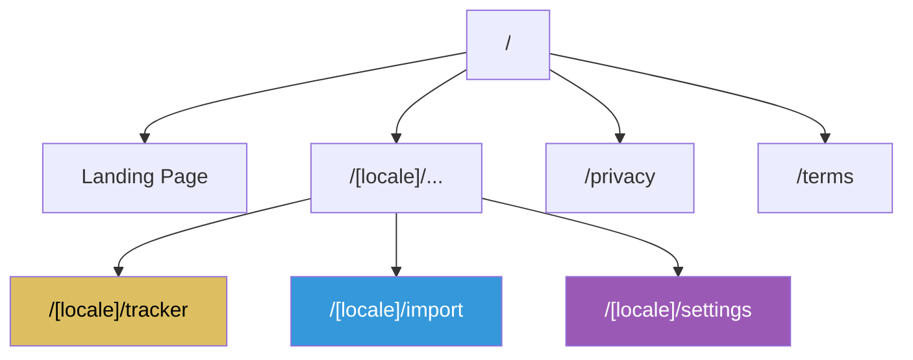
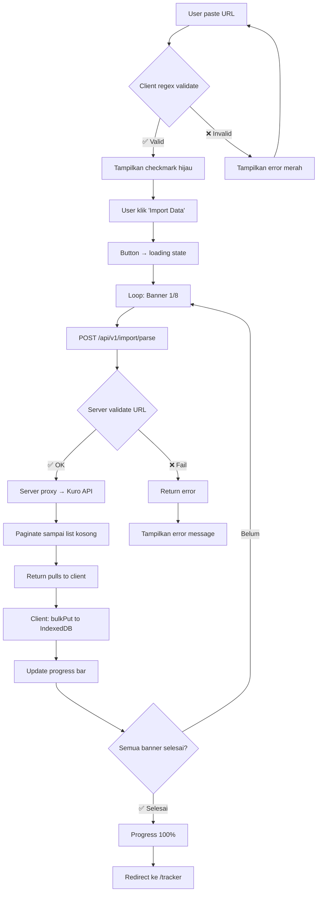
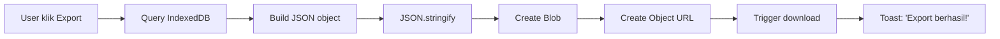
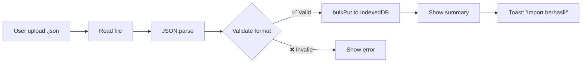

# 🎯 Wuwa Archive — Functional Specification Document (FSD)

> **Local-First Pull Tracker & Analytics Platform untuk Wuthering Waves**
> *Dokumen ini menjelaskan APA yang dilihat dan dialami user — bukan BAGAIMANA sistem dibangun secara teknis*

---

## 1. Overview

### 1.1 Scope Dokumen

Dokumen ini mendefinisikan **spesifikasi fungsional** lengkap Wuwa Archive — mencakup setiap halaman, komponen UI, interaksi user, state management, dan aturan tampilan data. FSD berfokus pada **user experience**: apa yang dilihat, apa yang terjadi saat interaksi, dan bagaimana data ditampilkan.

### 1.2 Referensi Dokumen

| Dokumen | Lokasi | Isi |
|---------|--------|-----|
| **Implementation Plan** | `implementation_plan.md` | Keputusan arsitektur, tech stack, strategi eksekusi |
| **Research Data** | `research_character_weapon_data.md` | Data karakter, senjata, elemen, dan ID mapping |
| **PRD** | `docs/prd.md` | Product requirements, user stories, success metrics |
| **TSD** | `docs/tsd.md` | Technical specification, API contracts, database schema |

### 1.3 Terminologi

| Term | Definisi |
|------|----------|
| **Convene** | Sistem gacha/pull di Wuthering Waves |
| **Pity** | Jumlah pull sejak terakhir mendapat item 5★ atau 4★ |
| **50/50** | Mekanisme di Featured Resonator banner: 50% chance dapat featured, 50% standard |
| **Guarantee** | Status setelah kalah 50/50 — pull 5★ berikutnya dijamin featured |
| **Banner** | Periode promosi karakter/senjata tertentu (`cardPoolType` 1–8+) |
| **Hard Pity** | Pull ke-80 (atau ke-50 untuk Novice) — dijamin 5★ |
| **Soft Pity** | Pull ke-66+ — probabilitas naik drastis |
| **Local-First** | Semua data tersimpan di browser user, bukan di server |

---

## 2. Sitemap & Navigation

### 2.1 Route Map



| Route | Halaman | Rendering | Auth |
|-------|---------|-----------|------|
| `/` | Landing Page | SSG (Static) | ❌ Tidak perlu |
| `/[locale]/tracker` | Dashboard Tracker | CSR (Client) | ❌ Tidak perlu |
| `/[locale]/import` | Import Wizard | CSR (Client) | ❌ Tidak perlu |
| `/[locale]/settings` | Settings & Profile | CSR (Client) | ❌ Tidak perlu |
| `/privacy` | Privacy Policy | SSG (Static) | ❌ Tidak perlu |
| `/terms` | Terms of Service | SSG (Static) | ❌ Tidak perlu |

- **`[locale]`** mendukung `en` (English) dan `id` (Bahasa Indonesia)
- Default locale: `en` — redirect otomatis jika locale tidak spesifik
- Contoh: `/en/tracker`, `/id/tracker`

### 2.2 Navigation Structure

#### Navbar (Sticky Top)

| Posisi | Elemen | Aksi |
|--------|--------|------|
| Kiri | Logo + "Wuwa Archive" | Link ke `/` |
| Tengah | Tracker · Import · Settings | Link navigasi utama, active state highlight |
| Kanan | Language Switcher (EN/ID) | Toggle locale, redirect ke halaman sama |
| Kanan | Theme Toggle (🌙/☀️) | Toggle dark/light mode instant |

- Navbar **fixed/sticky** di bagian atas viewport
- Pada mobile: hamburger menu (☰) menggantikan link tengah
- Active page ditandai dengan underline/highlight aksen gold (`#ddbf61`)

#### Footer

| Elemen | Detail |
|--------|--------|
| Kiri | "Wuwa Archive — Not affiliated with Kuro Games" |
| Tengah | Link: Privacy Policy · Terms of Service |
| Kanan | GitHub repo link + version number |

---

## 3. Halaman Landing Page (`/`)

### 3.1 Deskripsi Umum

Landing page adalah halaman pertama yang dilihat visitor. Berfungsi sebagai **introduksi** ke Wuwa Archive dan mengarahkan user ke fitur utama.

> [!NOTE]
> Desain detail landing page **ditunda ke Tahap 3 UI Slicing** — akan mengikuti desain yang dibuat oleh user. Spesifikasi di bawah adalah kerangka fungsional minimum.

### 3.2 Section Layout

| # | Section | Konten |
|---|---------|--------|
| 1 | **Hero Section** | Headline, tagline, CTA button "Start Tracking" → `/[locale]/import` |
| 2 | **Feature Overview** | 3-4 card: Local-First Privacy, Pity Tracking, Pull Statistics, Export/Import |
| 3 | **How It Works** | 3 langkah sederhana: Run Script → Paste URL → View Stats |
| 4 | **Call to Action** | Secondary CTA: "Import Your Data Now" → `/[locale]/import` |

### 3.3 Behavior

- **No data required** — halaman ini 100% statis, tidak perlu IndexedDB
- CTA button mengarahkan ke halaman Import dengan locale yang sesuai
- Animasi entrance menggunakan Framer Motion (fade-in, slide-up)

---

## 4. Halaman Tracker (`/[locale]/tracker`)

Halaman utama — **Dashboard** yang menampilkan semua data pull, statistik pity, dan analytics. Semua data bersumber dari **IndexedDB** melalui Zustand store.

### 4.1 ConveneTypeTabs

#### Visual Appearance
- Horizontal tab bar di bagian atas dashboard
- Setiap tab menampilkan **nama banner** dan **ikon** (jika tersedia)
- Tab aktif memiliki border bawah gold (`#ddbf61`) dan background subtle

#### Tab Items

| Tab | Label | `cardPoolType` |
|-----|-------|----------------|
| 1 | Novice Convene | 1 |
| 2 | Permanent Resonator | 2 |
| 3 | Permanent Weapon | 3 |
| 4 | Featured Resonator | 4 |
| 5 | Featured Weapon | 5 |
| 6 | Beginner's Choice | 6 |
| 7 | New Voyage Resonator | 7 |
| 8 | New Voyage Weapon | 8 |

#### Behavior
- Klik tab → **instant switch** — data sudah di memory (Zustand), tidak ada loading
- Tab menampilkan **badge** dengan jumlah total pull di banner tersebut (e.g., "120")
- Tab yang tidak memiliki data menampilkan badge "0" dengan opacity rendah
- Pada mobile: tab bar menjadi **horizontally scrollable** dengan snap-to-tab

#### Data Source
- `pullStore.pullsByPool[cardPoolType]` dari Zustand
- Computed dari IndexedDB saat profile di-load

#### Empty State
- Jika TIDAK ada data di semua banner: tampilkan **Onboarding Card**
- Onboarding card menampilkan ilustrasi + teks: *"Belum ada data. Import pull pertamamu!"*
- CTA button → navigasi ke `/[locale]/import`

---

### 4.2 PityCircularGauge

#### Visual Appearance
- **Circular progress ring** (donut chart) menampilkan current pity count
- Angka besar di tengah lingkaran: jumlah pity saat ini (e.g., "47")
- Label di bawah angka: "/ 80" (atau "/ 50" untuk Novice)
- Ring terisi searah jarum jam sesuai persentase pity

#### Color Coding

| Range | Warna | HEX | Status |
|-------|-------|-----|--------|
| 1 – 50 | 🟢 Hijau | `#2ecc71` | Safe — masih jauh dari pity |
| 51 – 65 | 🟡 Kuning | `#f1c40f` | Caution — mendekati soft pity |
| 66 – 80 | 🔴 Merah | `#e74c3c` | Danger — zona soft/hard pity |

#### Behavior
- Warna ring dan angka berubah secara smooth (CSS transition) saat pity berubah
- Hover/tap pada gauge menampilkan tooltip: *"Soft pity dimulai dari pull ke-66"*
- Animasi ring fill saat pertama kali render (Framer Motion, 0.5s ease-out)

#### Data Source
- `pityStore.pityByPool[activePool].currentPity5` dari Zustand
- `maxPity` = 50 untuk `cardPoolType === 1`, 80 untuk lainnya

#### Empty State
- Pity = 0: Ring kosong, angka "0", teks *"Mulai dari nol! 🎉"*

---

### 4.3 ConveneHistoryDataGrid

#### Visual Appearance
- **Virtual scrolling table** menampilkan semua record pull untuk banner aktif
- Kolom-kolom:

| # | Kolom | Width | Konten |
|---|-------|-------|--------|
| 1 | **#** | 40px | Nomor urut (descending — terbaru di atas) |
| 2 | **Icon** | 48px | Ikon karakter/senjata (WebP, rounded) |
| 3 | **Name** | flex | Nama item + badge rarity (★) |
| 4 | **Type** | 80px | "Resonator" atau "Weapon" |
| 5 | **Pity** | 60px | Jumlah pity saat pull ini (e.g., "67") |
| 6 | **Time** | 120px | Relative time + absolute tooltip |

#### Rarity Styling

| Rarity | Background | Text | Effect |
|--------|-----------|------|--------|
| 5★ | Gradient gold subtle | Gold (`#ddbf61`) | ✨ Shimmer animation pada row |
| 4★ | Gradient purple subtle | Purple (`#9b59b6`) | Tanpa efek khusus |
| 3★ | Transparent | Blue (`#3498db`) | Tanpa efek khusus |

#### Behavior
- **Virtual rendering** — hanya baris yang terlihat di viewport yang di-render (via `@tanstack/react-virtual`)
- Performa optimal untuk **10.000+ rows** tanpa lag
- Sort default: terbaru di atas (descending by `time`)
- Scroll smooth dengan momentum pada mobile
- Row click → tidak ada aksi (MVP) — Phase 2: expand detail

#### Data Source
- `pullStore.pullsByPool[activePool]` diurutkan descending by `time`
- Icon path: `getItemIcon(pull.name, pull.resourceType)` dari asset mapping
- Fallback icon: `/assets/placeholder.webp` jika item tidak dikenal

#### Empty State
- Tabel kosong: pesan *"Tidak ada data pull untuk banner ini"*
- Subtle illustration (empty box icon)

---

### 4.4 FiftyFiftyTracker

#### Visual Appearance
- **Card** menampilkan statistik 50/50 untuk Featured Resonator banner (`cardPoolType === 4`)
- Layout:
  - Header: "50/50 Tracker"
  - Stat row 1: **Win / Loss ratio** — e.g., "5W / 3L"
  - Stat row 2: **Win rate** — e.g., "62.5%"
  - Status badge: **"GUARANTEE 🔒"** (kuning) atau **"50/50 ⚡"** (biru)

#### Behavior
- Hanya tampil saat `cardPoolType === 4` (Featured Resonator)
- Tersembunyi (hidden) untuk banner lain — digantikan placeholder atau komponen lain
- Badge "GUARANTEE" berkedip subtle jika guarantee aktif
- Hover pada "W/L" menampilkan tooltip list: *"Win: Jiyan, Yinlin, Jinhsi | Lose: Calcharo, Verina"*

#### Data Source
- `pityStore.pityByPool[4].fiftyFiftyWins` dan `fiftyFiftyLosses`
- `pityStore.pityByPool[4].guaranteeActive`
- Win/Loss ditentukan dari `banner-history.ts` mapping

#### Empty State
- Jika belum ada 5★ di banner 4: *"Belum ada data 50/50. Dapatkan 5★ pertamamu!"*

---

### 4.5 PullRatioStats

#### Visual Appearance
- **Card** menampilkan distribusi pull berdasarkan rarity
- Visualisasi: **Horizontal stacked bar** atau **Pie chart** (mini)
- Breakdown angka di bawah chart:

| Rarity | Label | Warna |
|--------|-------|-------|
| 5★ | "5★: 3 (2.5%)" | Gold `#ddbf61` |
| 4★ | "4★: 15 (12.5%)" | Purple `#9b59b6` |
| 3★ | "3★: 102 (85.0%)" | Blue `#3498db` |

#### Behavior
- Chart dianimasikan saat pertama kali muncul (bar grow / pie sweep)
- Persentase dihitung: `(count / totalPulls) * 100`, rounded ke 1 desimal
- Hover segment chart → tooltip dengan angka tepat

#### Data Source
- Dihitung dari `pullStore.pullsByPool[activePool]`
- Filter by `qualityLevel` (3, 4, 5)

#### Empty State
- Jika tidak ada pull: chart kosong, teks *"Import data untuk melihat statistik"*

---

### 4.6 LuckPercentilePanel

#### Visual Appearance
- **Card** menampilkan statistik keberuntungan user
- Stat utama: **Average Pity** — angka besar (e.g., "62.3")
- Sub-stat: Total 5★ count dan total pull count
- Keterangan: *"Rata-rata jumlah pull yang dibutuhkan untuk mendapatkan 5★"*

#### Behavior
- Average Pity dihitung sebagai **mean dari semua jarak 5★**
- Warna angka mengikuti pity color coding:
  - < 60: Hijau (lucky)
  - 60–70: Kuning (average)
  - \> 70: Merah (unlucky)

> [!NOTE]
> **MVP**: Statistik ini bersifat **lokal saja** — hanya berdasarkan data user sendiri. Perbandingan global (percentile ranking terhadap pemain lain) adalah fitur **Phase 2** yang memerlukan opt-in Global Stats.

#### Data Source
- `pityStore.pityByPool[activePool].averagePity`
- `pityStore.pityByPool[activePool].total5Stars`

#### Empty State
- Jika belum ada 5★: *"Belum cukup data — minimal 1 kali 5★ diperlukan"*

---

### 4.7 ServerResetCountdown

#### Visual Appearance
- **Compact bar** atau **pill badge** di bagian atas/bawah dashboard
- Menampilkan: **"Server Reset in: 05:32:17"** (HH:MM:SS)
- Ikon jam (⏱️) di samping teks

#### Behavior
- Countdown menghitung mundur ke **04:00 UTC** setiap hari (daily reset Wuthering Waves)
- Update setiap detik (client-side `setInterval`)
- Saat countdown mencapai 00:00:00 → reset ke 24:00:00 dan mulai ulang
- Warna teks berubah saat mendekati reset:
  - \> 1 jam: warna normal (putih/hitam)
  - < 1 jam: kuning
  - < 10 menit: merah + subtle pulse animation

#### Data Source
- Murni client-side calculation — `Date.now()` vs next 04:00 UTC
- Tidak memerlukan data dari IndexedDB

#### Empty State
- Selalu aktif — tidak ada empty state

---

### 4.8 ExportButton

#### Visual Appearance
- **Button** bertuliskan "Export Data" atau ikon download (⬇️)
- Terletak di pojok kanan atas dashboard atau di dalam settings

#### Behavior
- Klik → generate JSON file → trigger browser download
- Filename format: `wuwa-archive-pulls-[playerUid].json`
- Button menampilkan loading spinner selama file di-generate (< 1 detik untuk data normal)
- Toast notification: *"Data berhasil di-export! ✅"*

#### Data Source
- `db.pulls.where('playerUid').equals(activeUid).toArray()`
- Digabung dengan profile metadata

---

## 5. Halaman Import (`/[locale]/import`)

Halaman wizard untuk mengimport data pull dari game ke browser. Mendukung **Windows** dan **Android** melalui tab-based interface.

### 5.1 PlatformTabsGroup

#### Visual Appearance
- **Dua tab besar** di bagian atas halaman: **🖥️ Windows** | **📱 Android**
- Tab aktif memiliki background filled dan border aksen
- Ikon platform di samping label

#### Behavior
- Klik tab → menampilkan instruksi spesifik platform
- Default tab: **Windows** (mayoritas player PC)
- Tab state disimpan di URL query param (`?platform=windows`) untuk shareable link

---

### 5.2 Windows Tab

#### 5.2.1 PowerShellCodeBlock

**Visual Appearance:**
- Code block dengan background gelap (`#1e1e1e`)
- Menampilkan command PowerShell:
  ```
  iwr -UseBasicParsing https://raw.githubusercontent.com/.../import.ps1 | iex
  ```
- Tombol **"Copy"** (📋) di pojok kanan atas code block

**Behavior:**
- Klik Copy → command di-copy ke clipboard
- Tombol berubah menjadi "Copied! ✅" selama 2 detik, lalu kembali ke "Copy"
- Instruksi di atas code block:
  1. *"Buka game Wuthering Waves"*
  2. *"Buka menu Convene History (riwayat pull) di dalam game"*
  3. *"Buka PowerShell, paste command di bawah, tekan Enter"*

#### 5.2.2 UrlInputField

**Visual Appearance:**
- Text input field besar dengan placeholder: *"Paste Convene URL di sini..."*
- Ikon link (🔗) di sebelah kiri
- Ikon status di sebelah kanan:
  - ⬜ Kosong (belum diisi)
  - ✅ Hijau (URL valid)
  - ❌ Merah (URL invalid)

**Behavior:**
- User paste URL → **instant regex validation** (client-side)
- Regex pattern:
  ```
  https://aki-gm-resources(-oversea)?\.aki-game\.(net|com)/aki/gacha/index\.html#/record\?[^\"\s]+
  ```
- URL otomatis di-**trim()** (hapus whitespace di awal/akhir)
- Jika valid: ikon ✅ hijau, border hijau, teks *"URL valid"*
- Jika invalid: ikon ❌ merah, border merah, teks *"Format URL tidak valid. Pastikan URL dari Convene History."*
- Jika kosong: border default, tanpa pesan
- URL tidak dikirim ke server sampai user klik Import — **validasi murni client-side**

#### 5.2.3 LogFileUploader

**Visual Appearance:**
- **Drag-and-drop zone** dengan border dashed
- Teks di tengah: *"Drag & drop Client.log di sini, atau klik untuk browse"*
- Ikon file upload (📁)
- Keterangan: *"Lokasi file: [Game]\\Client\\Saved\\Logs\\Client.log"*

**Behavior:**
- Drop file / klik → file picker terbuka (filter: `.log`, `.txt`)
- Setelah file dipilih: tampilkan nama file + ukuran file
- File dikirim ke server endpoint `/api/v1/import/upload-log`
- Server mengekstrak URL dari file → proses import
- Max file size: **5MB** — tampilkan error jika melebihi
- Tombol "Remove" (✕) untuk membatalkan file yang sudah dipilih

#### 5.2.4 ImportDataButton

**Visual Appearance:**
- **Primary button** besar: "🚀 Import Data"
- Warna gold aksen (`#ddbf61`) dengan teks gelap
- Disabled state (abu-abu) jika URL belum valid

**Behavior:**
- Klik → memulai import flow (lihat Section 8)
- Button berubah menjadi loading state dengan spinner
- Button disabled selama proses import berjalan
- Jika URL dan file upload keduanya ada → prioritaskan URL

#### 5.2.5 ImportProgressBar

**Visual Appearance:**
- **Progress bar** horizontal muncul di bawah button setelah import dimulai
- Label: *"Fetching banner 3/8..."*
- Persentase: *"37.5%"*
- Bar terisi dari kiri ke kanan

**Behavior:**
- Progress dihitung: `completedBanners / totalBanners * 100`
- Total banners = 8 (cardPoolType 1–8)
- Update setiap kali satu banner selesai di-fetch
- Warna bar: gradient dari biru ke gold
- Setelah 8/8 selesai: bar 100%, teks *"Import selesai! ✅"*
- Delay 1 detik → auto-redirect ke `/[locale]/tracker`

---

### 5.3 Android Tab

#### 5.3.1 Step-by-Step Instructions

**Visual Appearance:**
- Numbered step cards (1-6) dengan ikon ilustratif
- Setiap card berisi instruksi singkat + screenshot placeholder

**Langkah-langkah:**

| # | Instruksi | Detail |
|---|-----------|--------|
| 1 | Buka game | *"Buka Wuthering Waves di Android"* |
| 2 | Buka Convene History | *"Masuk ke menu riwayat pull di dalam game"* |
| 3 | Tunggu halaman memuat | *"Pastikan halaman history sudah tampil penuh"* |
| 4 | Aktifkan Airplane Mode | *"Aktifkan ✈️ Mode Pesawat di pengaturan cepat"* |
| 5 | Ganti tab banner | *"Klik tab banner lain — halaman akan menampilkan ERROR"* |
| 6 | Copy URL | *"Tekan lama pada URL di halaman error → Copy"* |

**Behavior:**
- Setiap langkah memiliki animasi accordion (expand/collapse)
- Step aktif ter-highlight
- Setelah step 6: menampilkan **UrlInputField** (komponen yang sama dengan Windows)

#### 5.3.2 UrlInputField (Shared Component)

- Komponen identik dengan Section 5.2.2
- User paste URL yang di-copy dari langkah 6

#### 5.3.3 ImportDataButton (Shared Component)

- Komponen identik dengan Section 5.2.4
- Trigger import flow yang sama

---

## 6. Halaman Settings (`/[locale]/settings`)

Halaman untuk mengelola profil, data, dan preferensi.

### 6.1 ProfileManager

#### Visual Appearance
- **Card** dengan judul "Profiles"
- List profil yang terhubung, masing-masing menampilkan:
  - Player UID (e.g., "800123456")
  - Server area (e.g., "Global")
  - Tanggal import terakhir (e.g., "3 hari lalu")
  - Badge "Active" pada profil aktif (gold)
- Tombol switch di setiap profil non-aktif

#### Behavior
- Klik "Switch" → ubah profil aktif → reload data di Zustand
- Profil baru otomatis muncul setelah import pertama
- Tidak ada cara manual untuk menambah profil — profil dibuat otomatis saat import
- Jika hanya 1 profil: tombol switch tidak muncul

#### Data Source
- `profileStore.profiles` dari Zustand, loaded dari `db.profiles`

#### Empty State
- Tidak ada profil: *"Belum ada profil. Import data untuk membuat profil pertama."*

---

### 6.2 ExportDataSection

#### Visual Appearance
- **Card** dengan judul "Export Data"
- Dropdown untuk memilih profil (jika > 1)
- Tombol "Export JSON" (⬇️)
- Keterangan: *"Download backup data pull sebagai file JSON"*

#### Behavior
- Klik Export → generate JSON → browser download
- File berisi: semua pull records + profile metadata + app version + timestamp
- Filename: `wuwa-archive-pulls-[UID].json`
- Toast: *"Export berhasil! File tersimpan di folder Downloads."*

---

### 6.3 ImportDataSection

#### Visual Appearance
- **Card** dengan judul "Import Backup"
- File upload area (drag-and-drop atau klik)
- Accept filter: `.json`
- Keterangan: *"Upload file backup yang sebelumnya di-export dari Wuwa Archive"*

#### Behavior
- Upload file → parse JSON → validasi format → `bulkPut()` ke IndexedDB
- Setelah import:
  - Tampilkan summary: *"Imported: 150 pulls (120 baru, 30 duplikat)"*
  - Toast sukses: *"Data berhasil di-import!"*
- Error handling:
  - File bukan JSON: *"Format file tidak didukung. Gunakan file .json"*
  - Format JSON tidak sesuai: *"Format data tidak valid. Pastikan file dari Wuwa Archive"*
  - File > 10MB: *"File terlalu besar. Maksimal 10MB"*

---

### 6.4 ClearDataSection

#### Visual Appearance
- **Card** dengan judul "Hapus Data" dan border merah subtle
- Dropdown profil (jika > 1)
- Tombol "Hapus Semua Data" (🗑️) — warna merah

#### Behavior
- Klik Hapus → **Confirmation Dialog** muncul:
  - Judul: *"Yakin ingin menghapus data?"*
  - Pesan: *"Semua data pull untuk UID [800123456] akan dihapus permanen dari browser ini. Tindakan ini tidak bisa dibatalkan."*
  - Tombol Cancel (abu-abu) dan tombol "Hapus Permanen" (merah)
- Konfirmasi → hapus semua pulls + profile dari IndexedDB
- Redirect ke halaman tracker (yang akan menampilkan empty state)
- Toast: *"Data berhasil dihapus."*

---

### 6.5 LanguageSwitcher

#### Visual Appearance
- **Toggle button** atau **dropdown** dengan flag ikon
- Options: 🇺🇸 English | 🇮🇩 Bahasa Indonesia

#### Behavior
- Klik/pilih → locale berubah → URL di-update (`/en/settings` ↔ `/id/settings`)
- Semua teks UI berubah sesuai locale baru
- Preferensi tersimpan di IndexedDB (`settings` table, key: `locale`)
- Refresh halaman tetap menggunakan locale terakhir

---

### 6.6 ThemeToggle

#### Visual Appearance
- **Toggle switch** atau **icon button**: 🌙 (dark) ↔ ☀️ (light)
- Animasi transisi smooth saat toggle (0.3s)

#### Behavior
- Klik → toggle antara dark mode dan light mode
- Default: **Dark mode**
- Preferensi tersimpan di IndexedDB (`settings` table, key: `theme`)
- Menggunakan CSS class pada `<html>` element (Tailwind `dark:` prefix)
- Menghormati `prefers-color-scheme` dari OS sebagai default awal jika belum ada preferensi tersimpan

---

## 7. Halaman Statis

### 7.1 Privacy Policy (`/privacy`)

#### Konten
- Judul: "Privacy Policy — Wuwa Archive"
- Tanggal efektif
- Poin-poin utama:
  1. **Data collection**: *"Kami TIDAK mengumpulkan data personal"*
  2. **Local storage**: *"Semua data tersimpan di browser Anda"*
  3. **Proxy server**: *"Server hanya mem-forward request, TIDAK menyimpan data"*
  4. **Cookies**: *"Hanya untuk preferensi UI (theme, locale)"*
  5. **Third-party**: *"Tidak ada third-party analytics atau tracking"*
  6. **Data deletion**: *"Anda dapat menghapus semua data kapan saja dari Settings"*

#### Behavior
- Halaman statis, SSG
- Tidak memerlukan locale (konten dalam bahasa Inggris)
- Link kembali ke halaman utama di akhir

---

### 7.2 Terms of Service (`/terms`)

#### Konten
- Judul: "Terms of Service — Wuwa Archive"
- Tanggal efektif
- Poin-poin utama:
  1. **Disclaimer**: *"Wuwa Archive bukan afiliasi Kuro Games"*
  2. **No warranty**: *"Layanan disediakan 'as is'"*
  3. **Data accuracy**: *"Kami tidak menjamin keakuratan data"*
  4. **Account safety**: *"Script kami hanya membaca log file, TIDAK memodifikasi game"*
  5. **Open source**: *"Kode sumber tersedia di GitHub (GPL-3.0)"*

#### Behavior
- Halaman statis, SSG
- Tidak memerlukan locale

---

## 8. Import Flow (Step-by-Step Detail)

### 8.1 Flow Diagram



### 8.2 Detailed Steps

#### Step 1 — URL Validation (Client-Side)
- User paste URL ke UrlInputField
- Client menjalankan regex validation secara instant
- Jika valid: ikon ✅, border hijau, ImportDataButton menjadi enabled
- Jika invalid: ikon ❌, border merah, button tetap disabled
- URL di-trim() otomatis

#### Step 2 — Import Initiation
- User klik "Import Data"
- Button berubah ke loading state (spinner + disabled)
- Progress bar muncul: *"Memulai import..."*

#### Step 3 — Sequential Banner Fetching
- Client mengirim **8 request berurutan** (satu per `cardPoolType`)
- Urutan: 1, 2, 3, 4, 5, 6, 7, 8
- Setiap request:
  ```
  POST /api/v1/import/parse
  Body: { conveneUrl: "...", cardPoolType: N }
  ```
- Server memproses:
  1. Validate URL format (regex)
  2. Extract params: `playerId`, `recordId`, `serverId`, `languageCode`
  3. Proxy request ke Kuro Games API (paginate semua halaman)
  4. Return raw pulls untuk 1 banner
  5. Server **langsung melupakan** data setelah response dikirim

#### Step 4 — Immediate Storage
- Setiap response diterima → **langsung** `db.pulls.bulkPut(pulls)`
- Deduplication otomatis via `id` field (upsert)
- Jika user re-import: data baru di-merge, duplikat di-skip

#### Step 5 — Progress Update
- Progress bar update setiap banner selesai:
  - Banner 1/8 selesai → 12.5%
  - Banner 2/8 selesai → 25.0%
  - ...
  - Banner 8/8 selesai → 100%
- Label: *"Fetching banner 3/8 — Featured Resonator..."*

#### Step 6 — Completion
- Semua 8 banner selesai → progress 100%
- Teks berubah: *"Import selesai! 🎉 Total: 450 pulls dari 8 banner."*
- Auto-create/update profile di IndexedDB
- Delay 1.5 detik → redirect ke `/[locale]/tracker`
- Zustand store otomatis reload data baru

### 8.3 Error States

| # | Error | Penyebab | Pesan untuk User | Recovery |
|---|-------|----------|-------------------|----------|
| 1 | **Token Expired** | URL sudah > 1-2 jam | *"URL sudah kedaluwarsa. Buka Convene History di game lagi untuk mendapatkan URL baru."* | Re-open game, re-run script |
| 2 | **Network Error** | Koneksi terputus atau server Kuro down | *"Gagal terhubung ke server. Periksa koneksi internet Anda."* | Retry button |
| 3 | **Empty Response** | Tidak ada data pull di banner tersebut | Bukan error — skip banner, lanjut ke berikutnya | Otomatis |
| 4 | **Invalid URL** | URL bukan dari Convene History | *"URL tidak valid. Pastikan URL berasal dari halaman Convene History di game."* | Re-paste URL |
| 5 | **Rate Limited** | User sudah > 5 import dalam 30 menit | *"Terlalu banyak request. Silakan coba lagi dalam [X] menit."* | Tunggu cooldown |
| 6 | **Server Error** | Kuro API internal error | *"Server game sedang bermasalah. Coba lagi nanti."* | Retry setelah beberapa menit |

> [!IMPORTANT]
> Error pada satu banner **TIDAK menghentikan** import banner lainnya. Jika banner 3 gagal, banner 4-8 tetap diproses. User akan melihat summary di akhir: *"7/8 banner berhasil. 1 banner gagal (Featured Weapon — token expired)."*

---

## 9. Export/Import Backup Flow

### 9.1 Export Flow



#### JSON Export Format

```json
{
  "version": "1.0.0",
  "app": "wuwa-archive",
  "exportedAt": "2026-06-05T10:00:00Z",
  "profile": {
    "playerUid": "800123456",
    "serverId": "76402e5b",
    "serverArea": "global",
    "lastImportAt": "2026-06-05T09:00:00Z"
  },
  "pulls": [
    {
      "id": "1234567890",
      "name": "Jiyan",
      "qualityLevel": 5,
      "resourceType": 1,
      "cardPoolType": 4,
      "time": "2026-05-30 08:00:00",
      "pityCount": 67,
      "isFiftyFiftyWin": true
    }
  ],
  "totalPulls": 450
}
```

### 9.2 Import Backup Flow



#### Validation Rules

| Check | Rule | Error Message |
|-------|------|---------------|
| File type | `.json` extension | *"Hanya file .json yang didukung"* |
| File size | ≤ 10MB | *"File terlalu besar (maks 10MB)"* |
| JSON valid | `JSON.parse` tidak throw | *"File bukan JSON yang valid"* |
| App field | `data.app === "wuwa-archive"` | *"File ini bukan backup Wuwa Archive"* |
| Version | `data.version` exists | *"Format backup tidak dikenal"* |
| Pulls array | `Array.isArray(data.pulls)` | *"Data pulls tidak ditemukan dalam file"* |

#### Import Summary Display

Setelah import berhasil, tampilkan card summary:

| Metric | Contoh |
|--------|--------|
| Total records dalam file | 450 |
| Records baru (belum ada) | 120 |
| Records duplikat (sudah ada) | 330 |
| Profil yang terpengaruh | 800123456 |

---

## 10. Data Display Rules

### 10.1 Pity Color Coding

Digunakan di semua komponen yang menampilkan pity: PityCircularGauge, ConveneHistoryDataGrid (kolom Pity), LuckPercentilePanel.

| Range Pity | Warna | HEX Code | Label | Konteks |
|------------|-------|----------|-------|---------|
| 1 – 50 | 🟢 Hijau | `#2ecc71` | Safe | Masih jauh dari soft pity |
| 51 – 65 | 🟡 Kuning | `#f1c40f` | Caution | Mendekati zona soft pity |
| 66 – 80 | 🔴 Merah | `#e74c3c` | Danger | Dalam zona soft/hard pity |

> [!NOTE]
> Untuk Novice banner (`cardPoolType === 1`) dengan hard pity 50, range disesuaikan: 1–30 hijau, 31–40 kuning, 41–50 merah.

### 10.2 Rarity Styling

| Rarity | Background | Text Color | HEX | Efek Tambahan |
|--------|-----------|------------|-----|---------------|
| **5★** | Linear gradient gold (subtle) | `#ddbf61` | Gold | ✨ Shimmer/glow animation pada row |
| **4★** | Linear gradient purple (subtle) | `#9b59b6` | Purple | — |
| **3★** | Transparent | `#3498db` | Blue | — |

Rarity star display: `★★★★★` (5 bintang gold), `★★★★` (4 purple), `★★★` (3 blue)

### 10.3 Character/Weapon Icon Resolution

```
1. Lookup dari mapping: CHARACTERS[name] atau WEAPONS[name]
2. Jika ditemukan → gunakan iconPath (e.g., "/assets/characters/jiyan.webp")
3. Jika TIDAK ditemukan → fallback ke placeholder:
   - Resonator: "/assets/placeholder-character.webp"
   - Weapon: "/assets/placeholder-weapon.webp"
4. Image loading: lazy load dengan blur placeholder
5. Error handling: onError → swap ke placeholder
```

Ikon ditampilkan sebagai:
- **Bulat (rounded-full)** untuk avatar di table
- Ukuran: 40×40px (table), 64×64px (detail card)
- Border: 2px solid sesuai rarity color

### 10.4 Time Format

| Konteks | Format | Contoh |
|---------|--------|--------|
| **Primary** (di tabel) | Relative time | *"2 jam lalu"*, *"3 hari lalu"*, *"2 bulan lalu"* |
| **Tooltip** (hover/tap) | Absolute datetime | *"30 Mei 2026, 15:00:00"* |
| **Export** (JSON) | ISO 8601 | `"2026-05-30T08:00:00"` |
| **Display di card** | Tanggal pendek | *"30 Mei 2026"* |

- Relative time menggunakan locale-aware formatting:
  - EN: "2 days ago", "3 hours ago"
  - ID: "2 hari lalu", "3 jam lalu"
- Cutoff: setelah 30 hari, tampilkan tanggal absolut langsung

### 10.5 Number Format

| Konteks | EN (locale=en) | ID (locale=id) |
|---------|----------------|-----------------|
| Angka besar | 1,234 | 1.234 |
| Persentase | 62.5% | 62,5% |
| Desimal | 0.8 | 0,8 |

- Menggunakan `Intl.NumberFormat(locale)` untuk konsistensi
- Tidak ada pembulatan berlebihan — tampilkan 1 desimal untuk persentase

---

## 11. Responsive Behavior

### 11.1 Desktop (>1024px)

| Area | Layout |
|------|--------|
| Navbar | Full horizontal — semua link terlihat |
| Dashboard | **Bento grid layout** — card tersusun dalam grid 3-4 kolom |
| PityGauge | Samping kiri, ukuran besar (200px diameter) |
| HistoryTable | Area utama, lebar penuh, tinggi ~60vh |
| Stats cards | Sidebar kanan atau row bawah |
| Import page | 2 kolom: instruksi (kiri), form (kanan) |
| Settings | Single column centered, max-width 720px |

### 11.2 Tablet (768–1024px)

| Area | Layout |
|------|--------|
| Navbar | Sama seperti desktop, font sedikit lebih kecil |
| Dashboard | **Stacked cards** — grid 2 kolom |
| PityGauge | Ukuran sedang (160px), di atas tabel |
| HistoryTable | Full width, tinggi ~50vh |
| Stats cards | 2 kolom grid di bawah tabel |
| Import page | Single column, instruksi di atas form |

### 11.3 Mobile (<768px)

| Area | Layout |
|------|--------|
| Navbar | **Hamburger menu** (☰) — slide-in drawer dari kanan |
| Dashboard | **Single column** — semua card stacked vertikal |
| ConveneTypeTabs | **Horizontally scrollable** dengan snap |
| PityGauge | Compact (120px), centered |
| HistoryTable | Full width, virtualized scroll, font lebih kecil |
| Stats cards | Full width, stacked |
| Import page | Single column, step-by-step accordion |
| Settings | Full width, padding minimal |

#### Mobile-Specific Behavior
- Swipe gestures pada ConveneTypeTabs untuk navigasi antar banner
- Pull-to-refresh gesture → reload data dari IndexedDB (bukan re-fetch dari API)
- Bottom navigation bar (fixed) sebagai alternatif hamburger menu (opsional, Phase 2)
- Font size minimum: 14px untuk readability
- Touch target minimum: 44×44px untuk semua interactive elements

---

## 12. Accessibility & UX

### 12.1 Keyboard Navigation

| Aksi | Shortcut | Scope |
|------|----------|-------|
| Navigasi tab | `Tab` / `Shift+Tab` | Global — semua interactive elements |
| Activate button/link | `Enter` / `Space` | Buttons, links, tabs |
| Switch banner tab | `Arrow Left` / `Arrow Right` | ConveneTypeTabs |
| Close dialog | `Escape` | Confirmation dialogs, modals |
| Copy code block | `Ctrl+C` (setelah select) | PowerShellCodeBlock |

- Semua interactive elements memiliki **visible focus ring** (2px solid outline, offset 2px)
- Focus ring warna: `#ddbf61` (gold) di dark mode, `#3498db` (blue) di light mode
- Tab order mengikuti visual layout (top-to-bottom, left-to-right)

### 12.2 Color Contrast (WCAG AA)

| Elemen | Foreground | Background | Ratio Target |
|--------|-----------|------------|-------------|
| Body text | `#f5f5f5` (dark) / `#1a1a1a` (light) | `#0a0a0a` / `#fceee3` | ≥ 4.5:1 |
| Gold accent | `#ddbf61` | `#0a0a0a` | ≥ 3:1 (large text) |
| Error red | `#e74c3c` | `#0a0a0a` | ≥ 3:1 |
| Success green | `#2ecc71` | `#0a0a0a` | ≥ 3:1 |

- Warna **tidak pernah** menjadi satu-satunya cara menyampaikan informasi
- Pity status menggunakan warna **DAN** label teks ("Safe", "Caution", "Danger")
- Rarity menggunakan warna **DAN** bintang (★★★★★)

### 12.3 Loading States

| Situasi | Loading Indicator |
|---------|-------------------|
| Initial page load | **Skeleton screens** — bentuk placeholder abu-abu beranimasi shimmer |
| Data loading dari IndexedDB | Skeleton pada card dan tabel (< 100ms biasanya) |
| Import in progress | Progress bar + spinner + teks status |
| Export in progress | Button spinner (< 1 detik) |
| Image loading | Blur placeholder → fade-in ke gambar asli |

#### Skeleton Screens Detail
- PityCircularGauge: lingkaran abu-abu beranimasi
- ConveneHistoryDataGrid: 5 row placeholder (bar abu-abu)
- Stats cards: rectangle placeholders
- Animasi: shimmer gradient dari kiri ke kanan (1.5s loop)

### 12.4 Error Messages

Semua error messages mengikuti format:

```
[Ikon] [Judul singkat]
[Penjelasan detail + saran perbaikan]
```

**Prinsip:**
1. **Human-readable** — hindari kode error teknis
2. **Actionable** — selalu sertakan saran perbaikan
3. **Tidak menyalahkan** — gunakan kalimat pasif (*"URL tidak valid"*, bukan *"Anda memasukkan URL yang salah"*)
4. **Kontekstual** — pesan berbeda untuk setiap situasi

**Contoh:**

| Situasi | ❌ Buruk | ✅ Baik |
|---------|---------|---------|
| Token expired | `Error 401: Unauthorized` | *"URL sudah kedaluwarsa. Buka menu Convene History di game, lalu jalankan script lagi untuk mendapatkan URL baru."* |
| Network error | `FETCH_FAILED` | *"Tidak dapat terhubung ke server. Periksa koneksi internet Anda dan coba lagi."* |
| Empty data | `No records found` | *"Tidak ada data pull ditemukan untuk banner ini. Ini normal jika Anda belum pernah pull di banner ini."* |

### 12.5 Toast Notifications

| Tipe | Warna | Ikon | Durasi | Contoh |
|------|-------|------|--------|--------|
| **Success** | Hijau | ✅ | 3 detik, auto-dismiss | *"Data berhasil di-import!"* |
| **Error** | Merah | ❌ | Persistent, perlu dismiss manual | *"Import gagal: URL kedaluwarsa"* |
| **Warning** | Kuning | ⚠️ | 5 detik, auto-dismiss | *"1 dari 8 banner gagal diproses"* |
| **Info** | Biru | ℹ️ | 3 detik, auto-dismiss | *"Beralih ke profil 800123456"* |

- Toast muncul di pojok kanan atas (desktop) atau atas tengah (mobile)
- Maksimal 3 toast stack sekaligus
- Animasi: slide-in dari kanan + fade-out saat dismiss

---

> [!IMPORTANT]
> Dokumen ini bersifat **living document** — akan di-update seiring perkembangan desain visual dan feedback dari user testing. Semua perubahan harus di-commit dengan pesan yang menjelaskan alasan perubahan.
