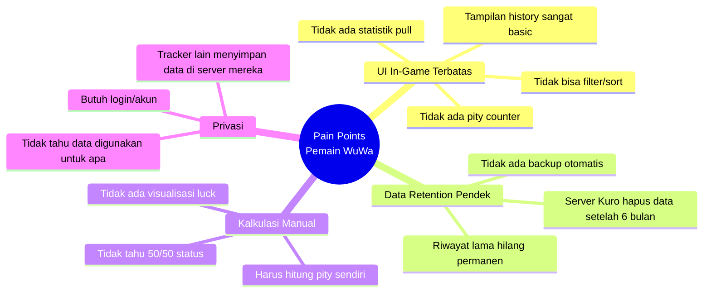
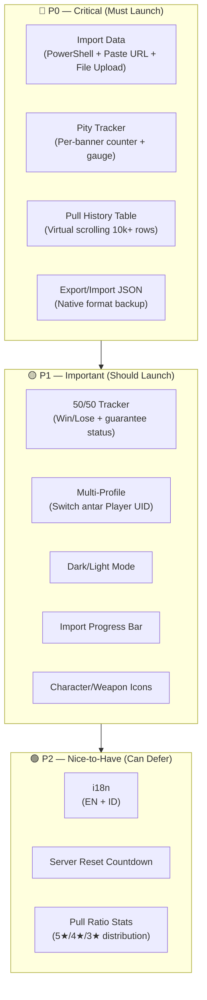
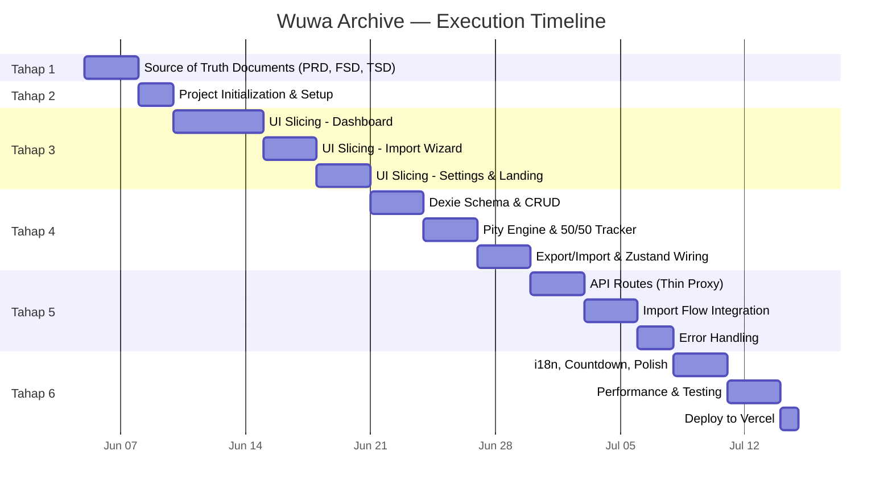

# 🗂️ Wuwa Archive — Product Requirements Document (PRD)

> **Dokumen**: Product Requirements Document (PRD) v1.0  
> **Produk**: Wuwa Archive — Local-First Pull Tracker & Analytics  
> **Tanggal**: Juni 2026  
> **Status**: ✅ APPROVED — Siap Eksekusi

---

## 1. Ringkasan Produk

### 1.1 Identitas

| Atribut | Detail |
|---------|--------|
| **Nama** | Wuwa Archive |
| **Tagline** | Local-First Pull Tracker & Analytics Platform untuk Wuthering Waves |
| **Domain MVP** | `wuwa-archive.vercel.app` (custom domain menyusul) |
| **Lisensi** | Open Source — GPL-3.0 |

### 1.2 Deskripsi Singkat

Wuwa Archive adalah **web application** yang membantu pemain Wuthering Waves melacak riwayat pull (convene), menghitung pity counter, menganalisis statistik keberuntungan, dan menyimpan data secara **permanen di browser** mereka sendiri. Semua data diproses 100% client-side — server hanya berperan sebagai thin proxy untuk mengambil data dari Kuro Games API.

### 1.3 Visi Produk

> *Menjadi platform pull tracking paling transparan dan privacy-respecting untuk komunitas Wuthering Waves — di mana pemain memiliki kontrol penuh atas data mereka, tanpa kompromi.*

### 1.4 Target User

| Segmen | Deskripsi |
|--------|-----------|
| **Primary** | Pemain Wuthering Waves (Global server) di platform Windows dan Android |
| **Secondary** | Pemain China server (dukungan API endpoint berbeda) |
| **Demografi** | Gacha gamers, usia 16-35, familiar dengan web apps |
| **Bahasa** | English & Bahasa Indonesia (MVP), ekspansi bahasa di Phase 2 |

### 1.5 Platform

| Platform | Support Level |
|----------|--------------|
| **Desktop Browser** (Chrome, Firefox, Edge, Safari) | ✅ Full Support |
| **Mobile Browser** (Android Chrome, iOS Safari) | ✅ Full Support (Responsive) |
| **Desktop App** | ❌ Tidak ada — Web-only |

### 1.6 Prinsip Inti

| Prinsip | Implementasi |
|---------|-------------|
| 🏠 **Local-First** | Semua data user tersimpan di IndexedDB browser. Server TIDAK menyimpan apapun |
| 🔍 **Transparansi Maksimal** | Open source (GPL-3.0), kode di-audit publik, zero data retention di server |
| 🔒 **Privacy by Design** | Tidak ada account/login di MVP, tidak ada tracking, tidak ada analytics pihak ketiga |
| ⚡ **Instant Experience** | Setelah import, semua navigasi dan kalkulasi berjalan offline dan instan |
| 📦 **Data Ownership** | User bisa export/import data kapan saja dalam format JSON — data milik mereka sepenuhnya |

---

## 2. Masalah yang Diselesaikan

### 2.1 Pain Points Pemain

### 2.2 Detail Masalah

| # | Masalah | Dampak | Solusi Wuwa Archive |
|---|---------|--------|---------------------|
| 1 | **UI in-game terlalu sederhana** — Hanya menampilkan daftar pull tanpa kalkulasi pity, rata-rata, atau visualisasi apa pun | Pemain tidak tahu seberapa dekat mereka ke guaranteed 5★ | Dashboard dengan **PityCircularGauge**, rata-rata pity, pull ratio, dan history table yang bisa di-filter/sort |
| 2 | **Data dihapus setelah 6 bulan** — Server Kuro Games secara otomatis menghapus riwayat pull yang lebih tua dari 6 bulan | Riwayat long-term hilang, tidak bisa analisis spending historis | Data disimpan di IndexedDB (persistent) + **JSON export** untuk backup permanen. Re-import periodik menambah data baru tanpa menghapus yang lama |
| 3 | **Tidak ada kalkulasi pity/statistik** — Pemain harus menghitung manual berapa pull sejak 5★ terakhir | Waste resources (pull di saat yang salah), tidak optimal | **Pity engine client-side** yang otomatis menghitung current pity, average pity, 50/50 win rate, dan pull distribution |
| 4 | **Privasi data di tracker lain** — Beberapa tracker menyimpan data di server mereka, membutuhkan login, dan tidak transparan soal penggunaan data | Kekhawatiran privasi, terutama karena data berisi player UID dan spending pattern | **Local-first architecture** — data TIDAK PERNAH meninggalkan browser. Server hanya proxy, zero data retention. Open source untuk audit publik |

### 2.3 Perbandingan dengan Solusi Existing

| Aspek | In-Game History | WuWa Tracker | **Wuwa Archive** |
|-------|----------------|-------------|-----------------|
| Pity Counter | ❌ | ✅ | ✅ |
| 50/50 Tracking | ❌ | ✅ | ✅ |
| Data Retention | 6 bulan | Server-side | **∞ (Local + Export)** |
| Privacy | N/A | Server stores data | **Zero retention** |
| Login Required | N/A | ✅ Yes | **❌ Tidak perlu** |
| Data Ownership | ❌ | Partial | **✅ 100% milik user** |
| Open Source | ❌ | ✅ | **✅ GPL-3.0** |

---

## 3. User Personas

### 3.1 Persona A — Casual Player ("Rina")

| Atribut | Detail |
|---------|--------|
| **Profil** | Mahasiswi, 22 tahun, main WuWa sebagai hiburan |
| **Frekuensi** | Login harian, pull saat ada primogem gratis |
| **Motivasi** | Ingin tahu berapa pull lagi sampai guaranteed 5★ |
| **Tech Literacy** | Menengah — bisa copy-paste command, tidak familiar terminal |
| **Kebutuhan Utama** | Lihat pity counter dengan cepat, UI yang intuitif |
| **Frustrasi** | Tracker lain terlalu kompleks, harus bikin akun |

> **Quote**: *"Aku cuma mau tahu berapa pull lagi sampai dapet karakter yang aku mau. Gak butuh fitur ribet."*

### 3.2 Persona B — Hardcore Player ("Dimas")

| Atribut | Detail |
|---------|--------|
| **Profil** | Software engineer, 28 tahun, spending moderate (Welkin + BP) |
| **Frekuensi** | Main aktif, pull strategis berdasarkan kalkulasi |
| **Motivasi** | Analisis mendalam — average pity, 50/50 win rate, spending efficiency |
| **Tech Literacy** | Tinggi — familiar dengan PowerShell, developer tools |
| **Kebutuhan Utama** | Statistik lengkap, history table dengan filtering, data export |
| **Frustrasi** | Data hilang setelah 6 bulan, tidak bisa track long-term spending |

> **Quote**: *"Aku butuh tahu 50/50 win rate ku supaya bisa plan pull untuk 2-3 banner ke depan."*

### 3.3 Persona C — Multi-Account Player ("Alex")

| Atribut | Detail |
|---------|--------|
| **Profil** | Content creator, 25 tahun, punya 2-3 akun WuWa |
| **Frekuensi** | Pull di semua akun, butuh manage data terpisah |
| **Motivasi** | Track pity dan history per akun, mudah switch antar profil |
| **Tech Literacy** | Tinggi — familiar dengan multiple tools dan workflow |
| **Kebutuhan Utama** | Multi-profile support, per-account export, quick switch |
| **Frustrasi** | Harus logout/login di tracker lain untuk ganti akun |

> **Quote**: *"Aku butuh bisa switch antar akun tanpa ribet. Tiap akun punya pity counter sendiri."*

---

## 4. User Stories

### 4.1 Import Data

| ID | Story | Priority | Persona |
|----|-------|----------|---------|
| US-01 | Sebagai **Casual Player**, saya ingin **menjalankan satu command PowerShell** untuk mendapatkan URL convene, sehingga saya **tidak perlu cari file log secara manual** | P0 | A, B |
| US-02 | Sebagai **Hardcore Player**, saya ingin **upload file Client.log via drag-and-drop**, sehingga saya punya **opsi alternatif** jika PowerShell script gagal | P0 | B |
| US-03 | Sebagai **Android Player**, saya ingin **paste URL convene dari Airplane Mode trick**, sehingga saya bisa **import data dari HP tanpa perlu PC** | P0 | A |
| US-04 | Sebagai **user**, saya ingin **melihat progress bar saat import** (fetching banner 3/8...), sehingga saya **tahu prosesnya berjalan dan tidak stuck** | P1 | A, B, C |
| US-05 | Sebagai **user**, saya ingin **mendapat pesan error yang jelas** jika token expired, sehingga saya **tahu harus re-open history di game** | P1 | A, B |

### 4.2 Pity Tracking

| ID | Story | Priority | Persona |
|----|-------|----------|---------|
| US-06 | Sebagai **Casual Player**, saya ingin **melihat pity counter saat ini** dalam visual gauge (🟢🟡🔴), sehingga saya **langsung tahu seberapa dekat ke 5★** | P0 | A |
| US-07 | Sebagai **Hardcore Player**, saya ingin **melihat average pity** di setiap banner, sehingga saya **bisa evaluasi seberapa lucky/unlucky saya** | P0 | B |
| US-08 | Sebagai **user**, saya ingin **pity counter terpisah per banner type**, sehingga saya **tidak bingung antara pity character dan weapon** | P0 | A, B, C |
| US-09 | Sebagai **user**, saya ingin **melihat pity di-recalculate otomatis** setelah import baru, sehingga saya **selalu melihat data terkini** | P0 | A, B |

### 4.3 Pull History

| ID | Story | Priority | Persona |
|----|-------|----------|---------|
| US-10 | Sebagai **user**, saya ingin **melihat tabel riwayat pull** yang lengkap dengan nama item, rarity, tanggal, dan pity count, sehingga saya **bisa review setiap pull** | P0 | A, B |
| US-11 | Sebagai **Hardcore Player**, saya ingin **tabel tetap smooth saat ada 10.000+ pull records**, sehingga **performa tidak terpengaruh** oleh jumlah data | P0 | B |
| US-12 | Sebagai **user**, saya ingin **switch antar banner tab secara instan**, sehingga saya **tidak perlu menunggu loading saat pindah tab** | P0 | A, B |
| US-13 | Sebagai **user**, saya ingin **melihat ikon karakter/senjata** di sebelah nama item, sehingga **tabel lebih visual dan mudah di-scan** | P1 | A, B |

### 4.4 50/50 Tracking

| ID | Story | Priority | Persona |
|----|-------|----------|---------|
| US-14 | Sebagai **Hardcore Player**, saya ingin **melihat riwayat 50/50 (Win/Lose)** di Featured Resonator banner, sehingga saya **tahu pattern luck saya** | P1 | B |
| US-15 | Sebagai **user**, saya ingin **tahu apakah guarantee saya aktif**, sehingga saya **tahu 5★ berikutnya pasti featured character** | P1 | A, B |
| US-16 | Sebagai **Hardcore Player**, saya ingin **melihat 50/50 win rate** (e.g., "5W / 3L — 62.5%"), sehingga saya **bisa track long-term luck** | P1 | B |

### 4.5 Export/Import Backup

| ID | Story | Priority | Persona |
|----|-------|----------|---------|
| US-17 | Sebagai **user**, saya ingin **export semua data saya ke file JSON**, sehingga saya **punya backup permanen di device saya** | P0 | A, B, C |
| US-18 | Sebagai **user**, saya ingin **import file JSON backup ke browser lain**, sehingga saya **bisa pindah device tanpa kehilangan data** | P0 | B, C |
| US-19 | Sebagai **user**, saya ingin **import tidak menduplikasi data**, sehingga saya **bisa re-import dengan aman tanpa data ganda** | P0 | B, C |

### 4.6 Profile Management

| ID | Story | Priority | Persona |
|----|-------|----------|---------|
| US-20 | Sebagai **Multi-Account Player**, saya ingin **menyimpan beberapa profil** (berdasarkan Player UID), sehingga saya **bisa track pity per akun** | P1 | C |
| US-21 | Sebagai **Multi-Account Player**, saya ingin **switch profil aktif dengan satu klik**, sehingga **tidak perlu logout/login** | P1 | C |
| US-22 | Sebagai **user**, saya ingin **menghapus semua data untuk profil tertentu**, sehingga saya **bisa clean up akun yang tidak aktif** | P1 | C |

### 4.7 Settings & Preferences

| ID | Story | Priority | Persona |
|----|-------|----------|---------|
| US-23 | Sebagai **user**, saya ingin **memilih Dark atau Light mode**, sehingga saya **nyaman membaca di berbagai kondisi cahaya** | P1 | A, B |
| US-24 | Sebagai **Indonesian player**, saya ingin **menggunakan app dalam Bahasa Indonesia**, sehingga saya **lebih mudah memahami fitur-fitur** | P2 | A |
| US-25 | Sebagai **user**, saya ingin **melihat countdown ke server reset berikutnya**, sehingga saya **tahu kapan daily reset terjadi** | P2 | A, B |

---

## 5. Fitur MVP (Must-Have)

### 5.1 Prioritas Fitur

### 5.2 Detail Fitur MVP

#### 🔴 P0 — Critical

| # | Fitur | Deskripsi | User Stories |
|---|-------|-----------|-------------|
| F1 | **Import Data** | 3 metode: (1) PowerShell script → copy URL, (2) Paste URL manual, (3) Upload Client.log. Semua berakhir di endpoint proxy yang sama. Client mengirim 1 request per `cardPoolType` (8+ requests sequential) | US-01, US-02, US-03 |
| F2 | **Pity Tracker** | Circular gauge per banner type menampilkan current pity (color-coded: 🟢 aman, 🟡 soft pity, 🔴 hard pity). Termasuk average pity dan total 5★ count | US-06, US-07, US-08, US-09 |
| F3 | **Pull History Table** | Data grid menggunakan `@tanstack/react-virtual` untuk render 10k+ rows. Kolom: nama item, rarity (★), tanggal, pity count, banner type. Tabs per `cardPoolType` dengan instant switch | US-10, US-11, US-12 |
| F4 | **Export/Import JSON** | Export: download file `wuwa-archive-pulls-[UID].json`. Import: upload file → `bulkPut()` (upsert by ID — deduplication otomatis). Format native Wuwa Archive saja di MVP | US-17, US-18, US-19 |

#### 🟡 P1 — Important

| # | Fitur | Deskripsi | User Stories |
|---|-------|-----------|-------------|
| F5 | **50/50 Tracker** | Khusus `cardPoolType=4` (Featured Resonator). Tracking Win/Lose berdasarkan `banner-history.ts` (hardcoded mapping tanggal → featured character). Tampilkan guarantee status dan win rate | US-14, US-15, US-16 |
| F6 | **Multi-Profile** | Mendukung beberapa Player UID. Profile otomatis dibuat saat import dari UID baru. Quick switch via dropdown di navbar. Data per profil terisolasi | US-20, US-21, US-22 |
| F7 | **Dark/Light Mode** | Default: Dark mode. Toggle tersimpan di IndexedDB (`settings` table). Menggunakan Tailwind CSS `dark:` variant | US-23 |
| F8 | **Import Progress Bar** | Real-time feedback: "Fetching banner 3/8..." dengan progress percentage. Error state untuk token expired atau network failure | US-04, US-05 |
| F9 | **Character/Weapon Icons** | Self-hosted WebP icons (~10-30KB each) di `/public/assets/`. Mapping via `characters.ts` dan `weapons.ts`. Placeholder untuk item yang belum ada iconnya | US-13 |

#### 🟢 P2 — Nice-to-Have

| # | Fitur | Deskripsi | User Stories |
|---|-------|-----------|-------------|
| F10 | **i18n (EN + ID)** | Menggunakan `next-intl`. Routing: `/en/tracker`, `/id/tracker`. Teks UI dalam 2 bahasa, nama item tetap English (sesuai API) | US-24 |
| F11 | **Server Reset Countdown** | Timer countdown ke daily reset (UTC-7). Client-side interval, tidak perlu server | US-25 |
| F12 | **Pull Ratio Stats** | Distribusi persentase 5★/4★/3★ dari total pull. Simple bar chart atau text-based stats | — |

### 5.3 Halaman Aplikasi (MVP)

| Route | Halaman | Deskripsi |
|-------|---------|-----------|
| `/tracker` | Dashboard | Pity gauge, history table, 50/50 tracker, pull stats |
| `/import` | Import Wizard | Platform tabs (Windows/Android), URL input, file upload, progress bar |
| `/settings` | Settings | Profile manager, export/import backup, clear data, theme toggle, language |
| `/privacy` | Privacy Policy | Halaman statis menjelaskan zero data retention |
| `/terms` | Terms of Service | Halaman statis syarat penggunaan |
| `/` | Landing Page | Hero section, fitur overview, CTA "Import Data Pertamamu" |

---

## 6. Fitur Phase 2 (Future)

> [!NOTE]
> Fitur Phase 2 memerlukan infrastruktur tambahan (database, auth, VPS) yang TIDAK ada di MVP. Diimplementasikan setelah MVP stabil dan mendapat traction.

| # | Fitur | Deskripsi | Teknologi Tambahan |
|---|-------|-----------|-------------------|
| 1 | **Opt-in Global Stats** | User dengan consent mengirim data anonim → aggregated statistics (rata-rata pity global, win rate komunitas). Opt-in only, bukan default | + Neon PostgreSQL, Redis, BullMQ |
| 2 | **Luck Percentile** | "Kamu lebih lucky dari 73% pemain" — berdasarkan data Global Stats | + Redis histogram |
| 3 | **Optional Cloud Backup** | User bisa backup data ke cloud dengan akun opsional. Sync antar device | + Better Auth, Neon PostgreSQL |
| 4 | **WuWa Tracker Import** | Support format export JSON dari WuWa Tracker (legacy compatibility) — memudahkan migrasi | JSON format converter |
| 5 | **CSV Export** | Export data sebagai CSV (untuk spreadsheet analysis) | Client-side only |
| 6 | **Additional Languages** | Japanese, Korean, Chinese, dll. via community translation | + Crowdin integration |
| 7 | **VPS Worker** | Background jobs untuk stats aggregation, heavy processing | + Hetzner/DigitalOcean VPS |

---

## 7. Fitur yang TIDAK Termasuk (Explicit Exclusions)

> [!WARNING]
> Fitur-fitur berikut secara sadar **TIDAK** dimasukkan ke dalam scope MVP maupun Phase 2 dekat. Ini bukan "belum sempat", tapi keputusan desain yang disengaja.

### 7.1 Excluded dari MVP

| # | Fitur | Alasan Exclusion |
|---|-------|-----------------|
| 1 | **Account/Login System** | Bertentangan dengan prinsip local-first. Ditambahkan di Phase 2 hanya sebagai opt-in cloud backup |
| 2 | **iOS Support** | Tidak ada metode yang reliable untuk extract convene URL dari iOS. Airplane Mode trick bisa bekerja tapi belum diverifikasi secara konsisten |
| 3 | **Xbox / PS5 Support** | Platform console tidak menyediakan akses ke log file atau URL extraction |
| 4 | **Linux Support** | Market share terlalu kecil untuk MVP. Bisa ditambahkan nanti karena shell script relatif portable |
| 5 | **Server-side Data Storage** | Fundamental architectural decision — data hanya di browser user |
| 6 | **Analytics/Tracking** | Tidak ada Google Analytics, Mixpanel, atau tracking tools pihak ketiga di MVP |
| 7 | **CAPTCHA** | Tidak diperlukan — rate limiting IP-based cukup untuk thin proxy |

### 7.2 Out of Scope (Tidak Direncanakan)

| # | Fitur | Alasan |
|---|-------|--------|
| 1 | **Team Builder** | Bukan domain pull tracker — sudah ada tools dedicated untuk ini |
| 2 | **Echo/Relic Tracker** | Scope berbeda, tidak terkait convene/gacha system |
| 3 | **Damage Calculator** | Scope berbeda, terlalu kompleks, sudah ada tools dedicated |
| 4 | **Build Guide / Tier List** | Konten editorial, bukan data tool |
| 5 | **Resin/Stamina Tracker** | Memerlukan real-time game integration yang tidak tersedia |
| 6 | **Social Features** | Bertentangan dengan prinsip privacy — tidak ada sharing/leaderboard |
| 7 | **Native Mobile App** | Web app responsive sudah cukup. PWA bisa dipertimbangkan nanti |
| 8 | **Push Notifications** | Tidak ada mekanisme push yang useful tanpa backend persistent |

---

## 8. Metrik Keberhasilan

### 8.1 Metrik Kuantitatif

| # | Metrik | Target MVP | Cara Ukur |
|---|--------|-----------|-----------|
| 1 | **Import Success Rate** | ≥ 90% berhasil pada percobaan pertama | Error logging client-side (opsional Sentry di Phase 2) |
| 2 | **Time to First Insight** | < 30 detik dari paste URL sampai melihat pity counter | Client-side performance measurement |
| 3 | **Data Completeness** | 100% pull records dari API berhasil disimpan ke IndexedDB | Verifikasi `total` dari API vs stored records count |
| 4 | **Page Load Time** | < 2 detik (First Contentful Paint) | Lighthouse audit |
| 5 | **Virtual Table Performance** | Smooth 60fps scroll dengan 10k+ rows | Manual testing + Performance profiling |

### 8.2 Metrik Kualitatif

| # | Metrik | Indikator |
|---|--------|-----------|
| 1 | **User Satisfaction** | Feedback positif di GitHub Issues / Discord |
| 2 | **User Retention** | Persentase user yang kembali untuk re-import (return visits) |
| 3 | **Bounce Rate** | Persentase visitor yang meninggalkan landing page tanpa import |
| 4 | **Community Adoption** | Jumlah GitHub stars, forks, dan mentions di komunitas WuWa |
| 5 | **Data Safety** | Zero incidents kebocoran data user (karena data tidak pernah dikirim ke server) |

### 8.3 Anti-Metrik (Hal yang TIDAK Dioptimasi)

| Anti-Metrik | Alasan |
|-------------|--------|
| Total registered users | Tidak ada sistem registrasi — tidak relevan |
| Server-side data volume | Server tidak menyimpan data — by design |
| Monthly Active Users (MAU) | Tidak ada tracking tanpa consent — privacy-first |

---

## 9. Batasan & Asumsi

### 9.1 Batasan Teknis

| # | Batasan | Detail | Mitigasi |
|---|---------|--------|----------|
| 1 | **Token Kuro API expired ~1–2 jam** | `record_id` (auth token) di URL convene memiliki TTL pendek | UI menjelaskan bahwa user harus re-open history in-game jika token expired |
| 2 | **Data retention server Kuro = 6 bulan** | Pull records lebih tua dari 6 bulan dihapus dari server Kuro Games | Simpan di IndexedDB (persistent) + reminder untuk export JSON backup |
| 3 | **Harus re-import secara periodik** | Karena token expired dan data baru tidak otomatis sync | Onboarding guidance: "Import setelah setiap session pull" |
| 4 | **Caching delay ~30 menit** | Pull terbaru mungkin belum muncul di API selama ~30 menit | UI note: "Pull terbaru bisa membutuhkan hingga 30 menit untuk muncul" |
| 5 | **Vercel serverless timeout 10 detik** (free tier) | Tidak bisa fetch semua banner sekaligus | Solusi: 1 request per `cardPoolType` (client sends 8+ sequential requests) |
| 6 | **IndexedDB storage limit** | Browser menyediakan ~50MB+ untuk IndexedDB per origin | Cukup untuk 100k+ pull records (estimasi ~500 bytes per record) |
| 7 | **Rate limiting per IP** | 5 import requests per 30 menit per IP address | Cukup untuk penggunaan normal. Power users yang butuh lebih bisa self-host |

### 9.2 Asumsi Produk

| # | Asumsi | Risiko jika Salah |
|---|--------|-------------------|
| 1 | **Kuro Games API tetap accessible** tanpa auth token tambahan (selain `record_id`) | Jika Kuro menambah auth layer, import flow harus disesuaikan |
| 2 | **URL format Kuro API tidak berubah** secara signifikan antar patch | Regex extractor mungkin perlu update. Mitigasi: regex pattern yang flexible |
| 3 | **Standard 5★ pool tetap 5 karakter** (Calcharo, Encore, Jianxin, Lingyang, Verina) | Jika Kuro menambah standard 5★, `standard-pool.ts` perlu diupdate |
| 4 | **Banner cycle tetap ~6 minggu** per version, 2 phase per version | Jika pattern berubah, `banner-history.ts` tetap bisa di-update (append-only) |
| 5 | **IndexedDB tersedia di semua target browser** | Didukung oleh semua modern browsers. Fallback tidak diperlukan |
| 6 | **User mau menjalankan PowerShell command** atau paste URL manual | Jika barrier terlalu tinggi, explore browser extension di Phase 2 |
| 7 | **Soft pity curve community-derived akurat** | Exact formula tidak di-disclose Kuro. Menggunakan estimasi community yang sudah divalidasi secara statistik |

### 9.3 Batasan Regional

| Region | Support Level | Catatan |
|--------|--------------|---------|
| **Global** | ✅ Full Support | API: `gmserver-api.aki-game2.net` |
| **China** | ⚠️ Partial | API: `gmserver-api.aki-game2.com` — perlu testing. Banner schedule bisa berbeda |

---

## 10. Timeline & Milestones

### 10.1 Strategi Eksekusi (6 Tahap, Frontend-First)

> [!IMPORTANT]
> Pendekatan **Frontend-First**: UI slicing dengan data dummy terlebih dahulu, baru kemudian integrasi backend. Ini memastikan user experience divalidasi sebelum effort backend dimulai.

### 10.2 Detail Milestones

| Tahap | Nama | Deliverables | Exit Criteria |
|-------|------|-------------|---------------|
| **1** | 📄 Source of Truth Documents | `prd.md`, `fsd.md`, `tsd.md` — dokumen referensi absolut | Semua 3 dokumen di-review dan approved |
| **2** | ⚙️ Project Initialization | Next.js 15 + TypeScript + Tailwind + Shadcn/UI + Dexie + Zustand + TanStack Query + Framer Motion + next-intl. Folder structure sesuai repo layout | `pnpm dev` berjalan, halaman default muncul, semua dependencies installed |
| **3** | 🎨 UI Slicing (Data Dummy) | Semua halaman MVP di-render dengan mock JSON data. Responsive, dark mode, glassmorphism. PityGauge, HistoryTable, ImportWizard, Settings page, Landing page | Visual QA passed di desktop + mobile. Semua komponen render tanpa error |
| **4** | 🧮 Client-Side Engine | Dexie database operational. Pity calculator menghitung data dari IndexedDB. 50/50 tracker. Export/Import JSON. Dummy data diganti dengan IndexedDB data. Zustand stores wired | Unit tests: pity calculator, URL validator. Data flows dari IndexedDB ke UI correctly |
| **5** | 🔌 Server Integration | 2 API routes berfungsi. Import UI → API → IndexedDB → Dashboard flow bekerja end-to-end. Error handling untuk 6 skenario | End-to-end import flow test dengan URL nyata (atau mock Kuro API) |
| **6** | 🚀 Polish & Deploy | i18n lengkap (EN + ID). Countdown timer. Virtual table performance verified. Cross-browser tested. Live di Vercel | Deployed ke `wuwa-archive.vercel.app`. Lighthouse score ≥ 80 |

### 10.3 Definition of Done (Global)

Sebuah fitur dianggap "Done" jika memenuhi semua kriteria berikut:

- [ ] Code di-commit ke main branch tanpa TypeScript error
- [ ] `pnpm build` berhasil tanpa warning/error
- [ ] Responsive di viewport 375px (mobile) sampai 1920px (desktop)
- [ ] Dark mode dan light mode keduanya bekerja
- [ ] Tidak ada console error di browser DevTools
- [ ] Sesuai dengan spesifikasi di PRD dan FSD

---

## Appendix A — Banner Type Reference

Referensi cepat `cardPoolType` yang digunakan di seluruh aplikasi:

| `cardPoolType` | Banner | Hard Pity | 50/50? | Pity Carryover |
|----------------|--------|-----------|--------|----------------|
| 1 | Novice Convene | 50 | ❌ | N/A (one-time) |
| 2 | Permanent Resonator | 80 | ❌ | Permanent |
| 3 | Permanent Weapon | 80 | ❌ | Permanent |
| 4 | Featured Resonator | 80 | ✅ 50/50 | ✅ Across featured banners |
| 5 | Featured Weapon | 80 | ❌ (100% rate-up) | ✅ Across featured banners |
| 6 | Beginner's Choice | 80 | ❌ | N/A (one-time) |
| 7 | New Voyage Resonator | 80 | varies | Independent |
| 8 | New Voyage Weapon | 80 | varies | Independent |
| 9+ | Collab / Giveback | varies | varies | ❌ Separate counter |

## Appendix B — Tech Stack Reference

| Layer | Teknologi | Versi | Catatan |
|-------|-----------|-------|---------|
| Framework | Next.js | 15 | App Router |
| Language | TypeScript | strict mode | |
| Styling | Tailwind CSS | latest | Mandated |
| UI Components | Shadcn/UI | latest | Composable primitives |
| Animations | Framer Motion | latest | Micro-animations |
| Client Storage | Dexie | latest | IndexedDB wrapper |
| Client State | Zustand | latest | UI + computed state |
| Server Fetching | TanStack Query | latest | Import proxy calls |
| Virtual Table | @tanstack/react-virtual | latest | 10k+ rows |
| i18n | next-intl | latest | EN + ID |
| Package Manager | PNPM | latest | Monorepo-efficient |
| Deployment | Vercel | Free tier | Serverless functions |

## Appendix C — Glossary

| Term | Definisi |
|------|---------|
| **Convene** | Sistem gacha/pull di Wuthering Waves (istilah in-game untuk summoning) |
| **Pity** | Counter yang menghitung jumlah pull sejak 5★ terakhir. Semakin tinggi, semakin dekat ke guaranteed |
| **Soft Pity** | Zona di mana probability 5★ mulai meningkat signifikan (~pull ke-66 dan seterusnya) |
| **Hard Pity** | Pull ke-80 (atau ke-50 untuk Novice) — guaranteed mendapat 5★ |
| **50/50** | Mekanisme di Featured Resonator banner: saat mendapat 5★, ada 50% chance featured dan 50% chance standard character |
| **Guarantee** | Jika kalah 50/50 (mendapat standard character), 5★ berikutnya dijamin 100% featured character |
| **Resonator** | Istilah in-game untuk karakter playable |
| **cardPoolType** | ID numerik yang mengidentifikasi tipe banner (1-9+) |
| **Thin Proxy** | Server yang hanya meneruskan (forward) request ke API lain tanpa menyimpan atau memproses data |
| **Local-First** | Arsitektur di mana data utama tersimpan di perangkat user, bukan di server |
| **IndexedDB** | Browser database API untuk menyimpan data terstruktur secara persistent |
| **Dexie** | Library wrapper untuk IndexedDB yang menyediakan API lebih mudah digunakan |
| **bulkPut** | Operasi Dexie yang melakukan upsert (insert jika baru, update jika sudah ada) — basis deduplikasi |

---

> **Dokumen ini adalah referensi produk utama untuk Wuwa Archive.** Semua keputusan fitur, scope, dan prioritas harus merujuk ke dokumen ini. Untuk detail teknis implementasi, lihat `implementation_plan.md`. Untuk spesifikasi frontend detail, lihat `fsd.md` (menyusul). Untuk spesifikasi teknis, lihat `tsd.md` (menyusul).
